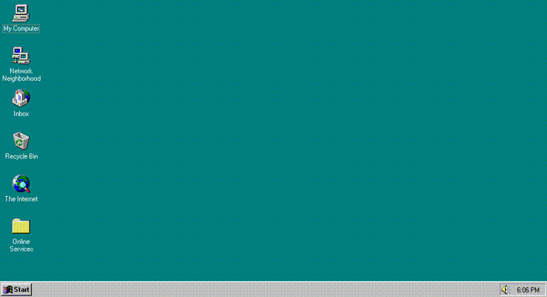
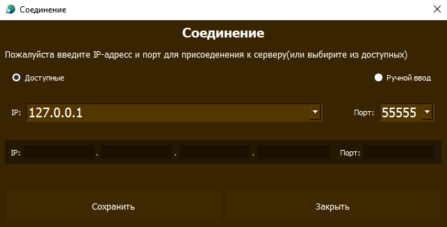
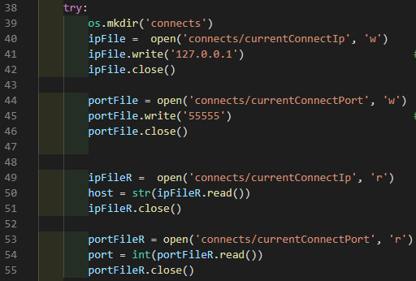

# TCP Чат комната на Python
---

***

Это достаточно простая tcp чат комната с графическим интерфейсом (PyQt5), созданная на python, использует в основе модуль socket.

Так же реализовано:
   * Локальное сохранение ника и переписки 
   * Возможность изменить имя
   * Настройка соединения
   * Уведомления о сообщениях

---
  
||
|:--:| 
| *Главное окно* |
  
  
||
|:--:| 
| *Окно настроек* |
  
  
||
|:--:| 
| *Изменение профиля* |
  
  
||
|:--:| 
| *Настройки соединения* |
  
  
||
|:--:| 
| *История сообщений* |
  

***

Хочу отметить, что программа ещё нуждается в доработке, например, могут быть проблемы с отображением при разрешении отличным от 1366 на 768, но в остальном работает вполне не плохо

---

***

# Запуск
Запуск производиться при помощи любого компилятора, поддерживающего python. Для начала, нужно запустить server.py, по умолчанию он настроен на локальные значения, но их легко можно изменить

||
|:--:| 
| *Указание ip, порта для сервера* |

Затем запускается main.py
(По умолчанию клиент подключаеться к локальным значениям, но позволяет их изменить при неудаче)

||
|:--:| 
| *Указание ip, порта для клиента* |

---

