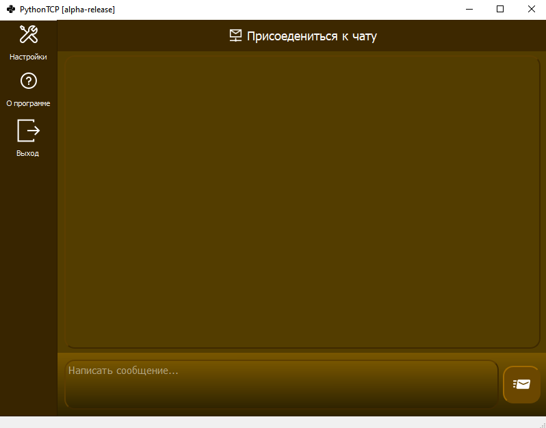
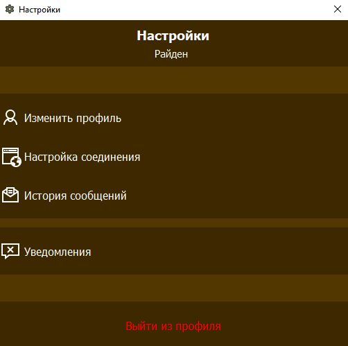
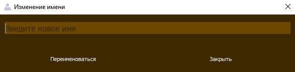
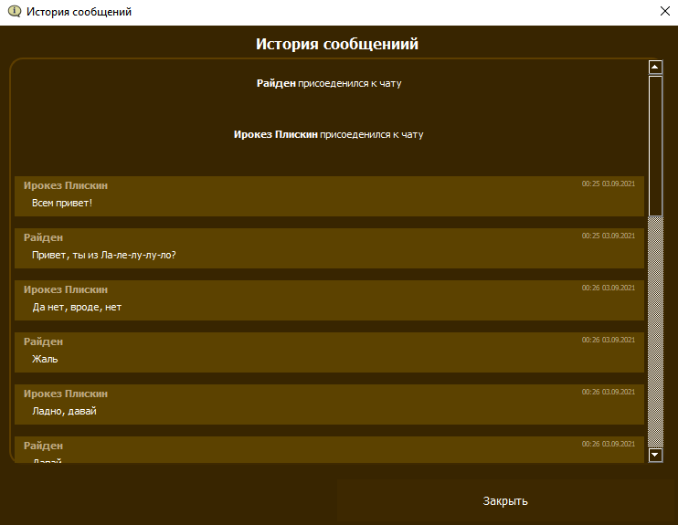
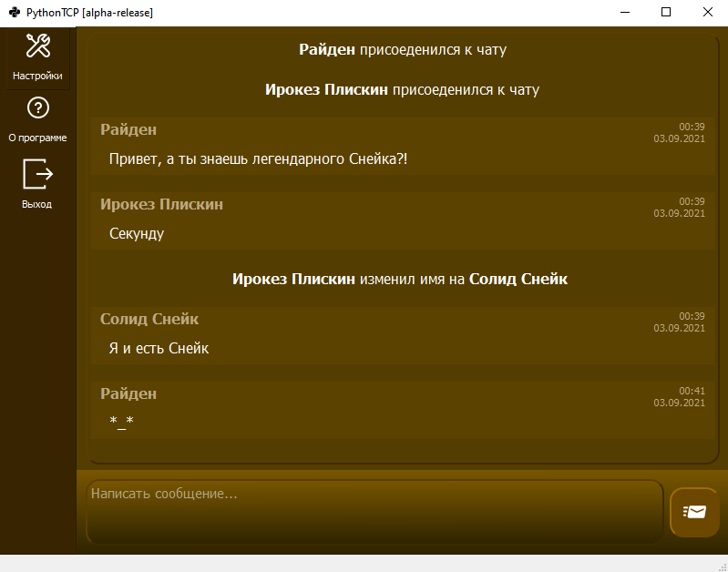

# TCP Чат комната на Python
---

***
Это достаточно простая tcp чат комната с графическим интерфейсом (PyQt5), созданная на python, использует в основе модуль socket.

Так же реализовано:
   * Локальное сохранение ника и переписки 
   * Возможность изменить имя
   * Настройка соединения
   * Уведомления о сообщениях

---

***
Хочу отметить, что программа ещё нуждается в доработке, например, могут быть проблемы с отображением при разрешении отличным от 1366 на 768, но в остальном работает вполне не плохо

---

***
##Запуск
Запуск производиться при помощи любого компилятора, поддерживающего python. Для начала, нужно запустить server.py, по умолчанию он настроен на локальные значения, но их легко можно изменить

Затем запускается main.py
(По умолчанию клиент подключаеться к локальным значениям, но позволяет их изменить при неудаче)

---

